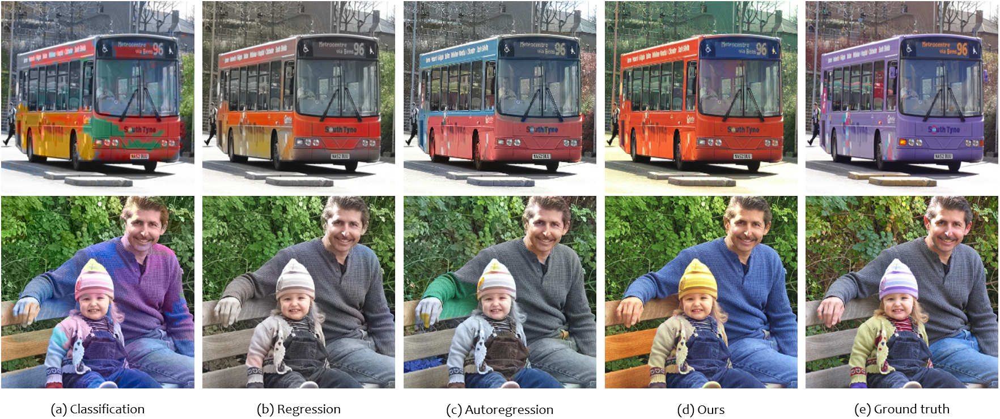

 <font face="STCAIYUN" size=12>Disentangled Image Colorization via Global Anchors</font>

Paper(<font color=red>coming soon</font>) | [Project Page](https://menghanxia.github.io/projects/disco.html) | Online Demo(<font color=red>coming soon</font>)

<div align="center">
	
</div>

<br>
:star: **This is the official implementation of our colorization work [DISCO](https://menghanxia.github.io/projects/disco.html)**.

### Network architecture
Our automatic colorization model consists of two conceptual components: (i) **anchor color representation** that predicts global color anchors (i.e. location and probabilistic colors) as the color distribution representation of the whole image; (ii) **anchor-conditioned color generation** that synthesizes the per-pixel colors deterministically by referring the specified anchor colors.

<div align="center">
	
</div>

### Updates
- **2022.08.27**: Train/Test code and pretrained models are released.
- **2022.08.04**: This repo is created.


### Dependencies and Installation

- Pytorch >= 1.7.1
- CUDA >= 10.1
- Other required packages in `requirements.txt`
```
# git clone this repository
git clone https://github.com/sczhou/CodeFormer
cd CodeFormer

# create new anaconda env
conda create -n codeformer python=3.8 -y
source activate codeformer

# install python dependencies
pip3 install -r requirements.txt
python basicsr/setup.py develop
```
<!-- conda install -c conda-forge dlib -->

### Quick Inference

##### Download Pre-trained Models:
Download the facelib pretrained models from [[Google Drive](https://drive.google.com/drive/folders/1b_3qwrzY_kTQh0-SnBoGBgOrJ_PLZSKm?usp=sharing) | [OneDrive](https://entuedu-my.sharepoint.com/:f:/g/personal/s200094_e_ntu_edu_sg/EvDxR7FcAbZMp_MA9ouq7aQB8XTppMb3-T0uGZ_2anI2mg?e=DXsJFo)] to the `weights/facelib` folder. 
You can download by run the following command OR manually download the pretrained models.
```
python scripts/download_pretrained_models.py facelib
```

Download the CodeFormer pretrained models from [[Google Drive](https://drive.google.com/drive/folders/1CNNByjHDFt0b95q54yMVp6Ifo5iuU6QS?usp=sharing) | [OneDrive](https://entuedu-my.sharepoint.com/:f:/g/personal/s200094_e_ntu_edu_sg/EoKFj4wo8cdIn2-TY2IV6CYBhZ0pIG4kUOeHdPR_A5nlbg?e=AO8UN9)] to the `weights/CodeFormer` folder. 
You can download by run the following command OR manually download the pretrained models.
```
python scripts/download_pretrained_models.py CodeFormer
```

##### Prepare Testing Data:
You can put the testing images in the `inputs/TestWhole` folder. If you would like to test on cropped and aligned faces, you can put them in the `inputs/cropped_faces` folder.


##### Testing on Face Restoration:
```
# For cropped and aligned faces
python inference_codeformer.py --w 0.5 --has_aligned --test_path [input folder]

# For the whole images
python inference_codeformer.py --w 0.7 --test_path [input folder]
```

NOTE that *w* is in [0, 1]. Generally, smaller *w* tends to produce a higher-quality result, while larger *w* yields a higher-fidelity result. 

The results will be saved in the `results` folder.

### Citation
If our work is useful for your research, please consider citing:

@article{zhou2022codeformer,
    author = {Zhou, Shangchen and Chan, Kelvin C.K. and Li, Chongyi and Loy, Chen Change},
	title = {Towards Robust Blind Face Restoration with Codebook Lookup TransFormer},
	journal = {arXiv preprint arXiv:2206.11253},
	year = {2022}
}