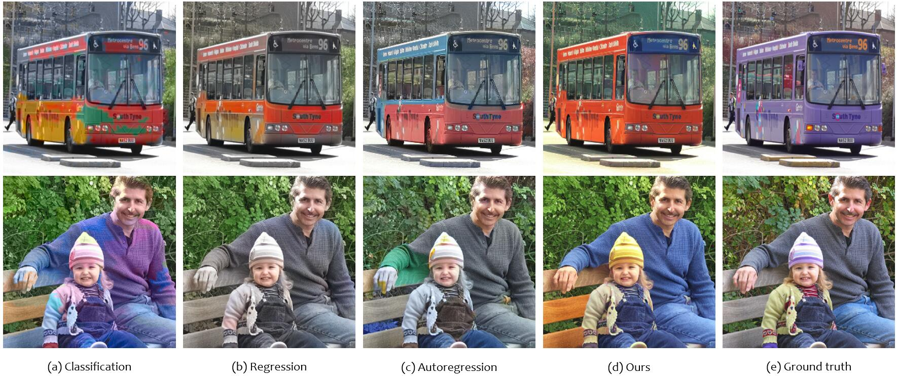

# Disentangled Image Colorization via Global Anchors
<!-- ------------------------------------------------------------------------------ -->
Colorization is multimodal by nature and challenges existing frameworks to achieve colorful and structurally consistent results. Even the sophisticated autoregressive model struggles to maintain long-distance color consistency due to the fragility of sequential dependence. To overcome this challenge, we propose a novel colorization framework that disentangles color multimodality and structure consistency through global color anchors, so that both aspects could be learned effectively. Our key insight is that several carefully located anchors could approximately represent the color distribution of an image, and conditioned on the sampled anchor colors, we can predict the image color in a deterministic manner by leveraging the internal correlation. Extensive experiments show that our method achieves notable superiority over various mainstream frameworks in perceptual quality.

	

## *Code coming soon!*

<!--
TODO:
The most admirable feature our colorization system is the automatically predicted color anchors, which supports automatic colorization, diverse colorization, and controllable colorization over a single model. So, to make this project impactful, we will provide a user-friendly interface demo (via HuggingFace) that allows users to select anchor amount and then modify the anchor color or even delete anchors manually (namely assign a special color status). This may offer users a more flexible colorizaton system.
-->